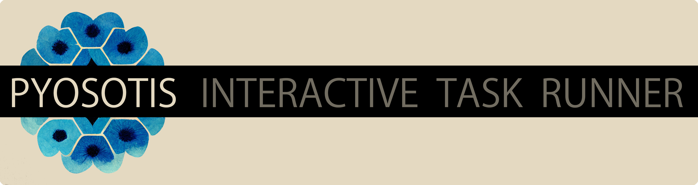

# Banner source



The logo was created using the [Midjourney](https://www.midjourney.com/) AI.

The prompt was ```myosotis, logo, abstract```.  
__Myosotis__ is the Latin name of the plant [forget-me-not](https://en.wikipedia.org/wiki/Myosotis) or [Vergissmeinnicht](https://de.wikipedia.org/wiki/Vergissmeinnicht) in German, an apt name for a checklist/to do list app (or so I think).

The banner was then created using Photoshop. Unfortunately, the PSD file has been lost.

* [link to Midjourney job](https://www.midjourney.com/app/jobs/c8a631cc-dd07-4e0f-a36e-5de03087040e/).
* __Prompt__: myosotis, logo, abstract
* __Job ID__: c8a631cc-dd07-4e0f-a36e-5de03087040e  
* __Seed__: 13813